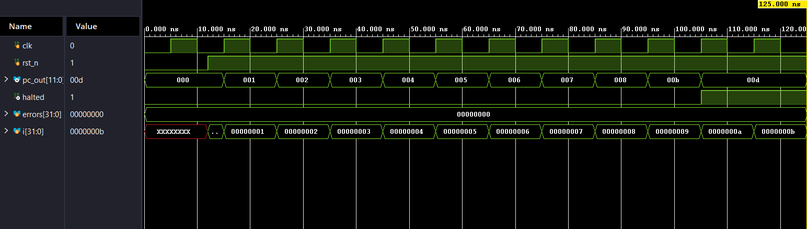

# 16-Bit RISC Processor — Custom ISA

A 16-bit single-cycle RISC processor built from scratch with a custom instruction set, implemented and verified in Verilog.

## Architecture

- **ISA**: Custom 10-instruction set across 3 formats — R-type, I-type, J-type
- **Datapath**: Harvard architecture (separate instruction & data memory)
- **Design style**: Single-cycle execution

## Files

| File | Description |
|---|---|
| `*.v` | RTL source modules (ALU, register file, control unit, datapath) |
| `*_tb.v` | Self-checking testbench |

## Simulation

Simulated and verified in **Xilinx Vivado** using a self-checking testbench that validates instruction execution against expected register/memory outputs.

**Waveform:**

## How to Run

1. Open the project in Xilinx Vivado
2. Add all `.v` source files
3. Set the testbench as the top module for simulation
4. Run behavioral simulation and inspect the waveform

## Key Learning

Designed the full instruction decode → execute → writeback flow for a custom ISA and validated correctness through simulation-based verification.
