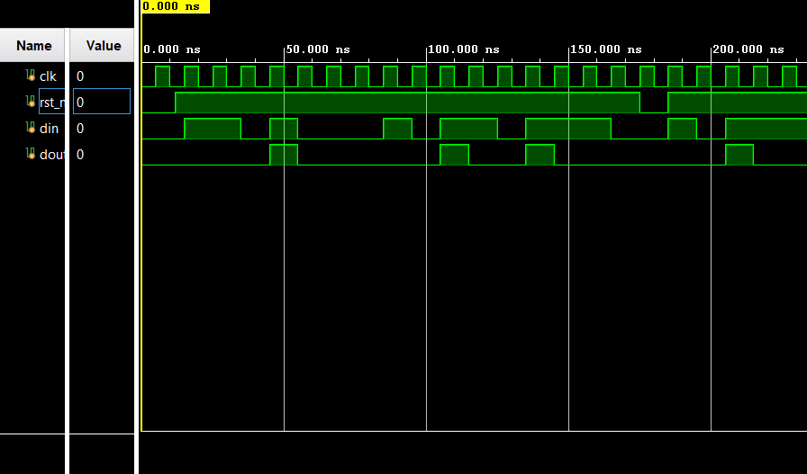
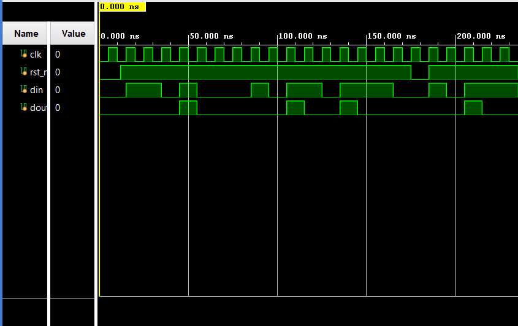

# Sequence Detector — Overlapping 1101 Pattern

An overlapping sequence detector that identifies the pattern `1101` in a serial input bitstream, implemented and compared using both Mealy and Moore FSM architectures.

## Design

- **Pattern**: 1101 (overlapping detection — last bits of one match can be reused for the next)
- **Mealy FSM**: Output depends on current state + input (faster response, one cycle less latency)
- **Moore FSM**: Output depends only on current state (glitch-free, more predictable timing)

## Bug Fix

Identified a state-count error in the initial Moore FSM design (incorrectly modeled with 6 states) and corrected it to a functionally accurate **5-state model**, verified against expected detection timing via waveform analysis.

## Files

| File | Description |
|---|---|
| `*.v` | Mealy and Moore FSM RTL implementations |
| `*_tb.v` | Self-checking testbench |

## Simulation

Verified in **Xilinx Vivado** — testbench drives a serial bitstream and checks the detector output against expected match points for both FSM styles.

**Mealy FSM Waveform:**

**Moore FSM Waveform (corrected 5-state model):**

## How to Run

1. Open the project in Xilinx Vivado
2. Add the FSM RTL and testbench files
3. Set the testbench as the top module
4. Run behavioral simulation and inspect the waveform

## Key Learning

Debugging the Moore FSM state-count error reinforced the difference between Mealy and Moore output timing and the importance of verifying state transitions against a golden reference.
